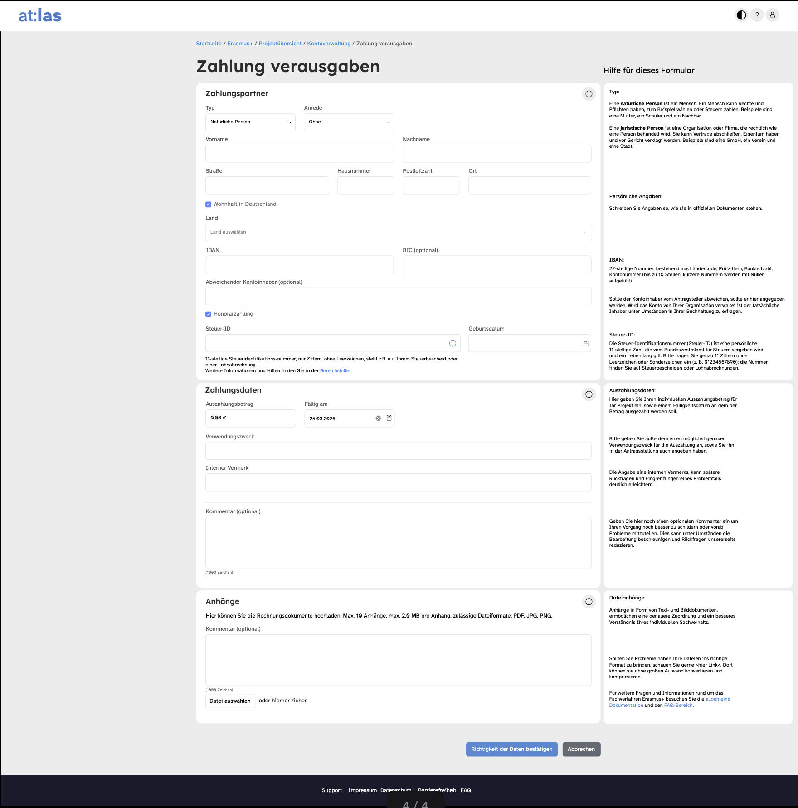
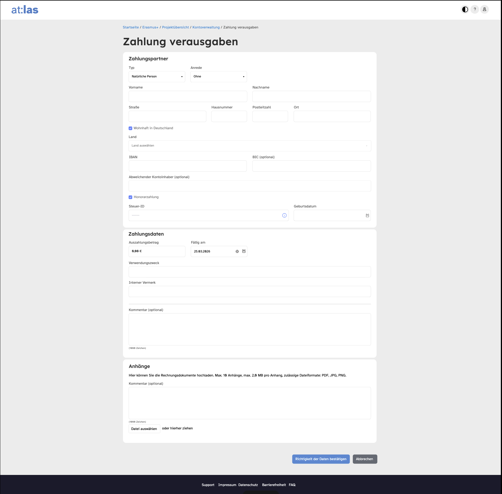

# Hilfesystem

Ein HTML/CSS/JS-Prototyp für ein **zweistufiges, kontextuelles Hilfesystem** in Web-Formularen. Demonstriert wird das Konzept am Beispiel des Formulars *"Zahlung verausgaben"* aus dem Fachverfahren **Erasmus+** (Design-Look des Systems **at:las**).

Ziel des Prototyps ist es zu zeigen, wie sich Nutzer:innen an zwei unterschiedlichen Stellen mit passend dosierter Hilfe unterstützen lassen: einmal auf Ebene eines ganzen Formularabschnitts, einmal direkt am einzelnen Eingabefeld – und wie beide Ebenen miteinander verknüpft sind.

## Die zwei Hilfe-Ebenen

### 1. Bereichshilfe (Section Help)
Jeder Formularabschnitt (*Zahlungspartner*, *Zahlungsdaten*, *Anhänge*) hat einen `?`-Button im Abschnitts-Header. Ein Klick öffnet eine seitliche Hilfekarte (`.help-card`) mit ausführlichen Erklärungen zu allen Feldern des Abschnitts, inkl. Hinweisen und Links zur allgemeinen Dokumentation/FAQ. Der Button wirkt als Toggle, ein eigener Schließen-Button (X) schließt die Karte immer.



### 2. Mikrohilfe (Inline Help / Tooltip)
Einzelne Felder (z. B. *Typ*, *Steuer-ID*, *Fällig am*, *Verwendungszweck*) haben einen kleinen `i`-Button. Er öffnet ein kompaktes Inline-Panel direkt unter dem Feld mit einer kurzen, feldspezifischen Erklärung.



### Verknüpfung beider Ebenen
Jede Mikrohilfe enthält einen Link *"Weitere Informationen und Hilfen finden Sie in der Bereichshilfe"*. Ein Klick darauf öffnet die zugehörige Bereichshilfe und scrollt automatisch zum passenden Unterabschnitt. Die Zuordnung erfolgt über ein gemeinsames Themen-Kürzel: Die ID der Mikrohilfe (`microhelp-typ`) wird zu einem Topic (`typ`) und mit dem `data-topic`-Attribut des passenden Abschnitts in der Bereichshilfe abgeglichen.

## Weitere Funktionen

- **Barrierefreiheit**: `aria-expanded`, `aria-controls` und `aria-label` an allen Hilfe-Buttons; Klick außerhalb eines offenen Panels schließt es; die Escape-Taste schließt das fokussierte Hilfe-Panel bzw. die offene Bereichshilfe und setzt den Fokus zurück auf den auslösenden Button.
- **Datumsfelder**: Ein sichtbares Textfeld im Format `TT.MM.JJJJ` ist mit einem unsichtbaren nativen `type="date"`-Feld gekoppelt. Der Kalender-Button öffnet den nativen Datepicker (`showPicker()`), ein Clear-Button leert das Feld. Manuelle Eingaben werden beim Verlassen des Felds geparst und auf Gültigkeit geprüft (z. B. wird `31.02.2026` abgelehnt). Das Feld *"Fällig am"* wird beim Laden automatisch mit dem heutigen Datum vorbelegt.

## Projektstruktur

| Datei/Ordner | Beschreibung |
|---|---|
| `index.html` | Formular-Markup mit den drei Abschnitten Zahlungspartner, Zahlungsdaten, Anhänge inkl. eingebetteter Hilfe-Elemente |
| `style.css` | Styling im at:las-Look (Farben, Header, Formular, Hilfekarten, Responsive-Verhalten) |
| `script.js` | `HelpSystem`-Klasse (Steuerung von Bereichs-/Mikrohilfe) sowie die Datumsfeld-Logik |
| `FormularSeiteBereichshilfeMikrohilfe.png`, `FormularSeiteToolTip.png` | Screenshots der beiden Hilfe-Ebenen |
| `manifest.json`, `browserconfig.xml`, `favicon*.png`, `apple-icon-*.png`, `android-icon-*.png`, `ms-icon-*.png` | PWA-/Favicon-Assets |
| `anleitung.txt` | Anleitung eines Favicon-Generators zum Einbinden der generierten Icon-Dateien |

## Verwendung

Der Prototyp ist eine rein statische Seite (Bootstrap 5.3.3 wird per CDN eingebunden). Es genügt, `index.html` im Browser zu öffnen, z. B.:

```bash
open index.html
```

Alternativ lokal hosten, z. B. mit:

```bash
npx serve .
```
