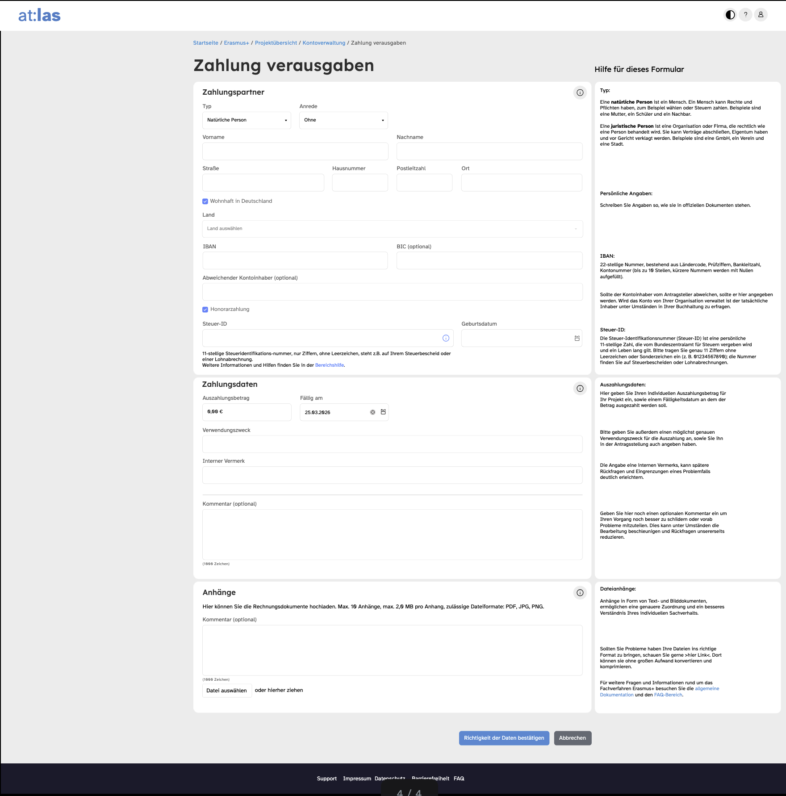

# Hilfesystem

Prototyp eines **zweistufigen, kontextuellen Hilfesystems** für Web-Formulare, am Beispiel des Formulars *"Zahlung verausgaben"* aus dem Fachverfahren Erasmus+ (Design-Look **at:las**). Entsteht im Rahmen einer Bachelorarbeit zu Barrierefreiheit in Verwaltungssoftware.



## Ausprobieren

- **`index.html`** — Formular mit Hilfesystem
- **`index.html?variante=baseline`** — dieselbe Formularseite ohne Hilfesystem (Vergleichs-Baseline für die geplante Nutzerstudie)

Reine statische Seite, kein Build-Schritt nötig:

```bash
open index.html
# oder lokal servieren:
npx serve .
```

## Die zwei Hilfe-Ebenen

- **Bereichshilfe**: `?`-Button im Header jedes Formularabschnitts öffnet eine seitliche Karte mit ausführlichen Erklärungen zu allen Feldern des Abschnitts.
- **Mikrohilfe**: `i`-Button an einzelnen Feldern öffnet eine kurze, feldspezifische Erklärung direkt darunter.
- Jede Mikrohilfe verlinkt auf "Weitere Informationen in der Bereichshilfe" — das öffnet die Bereichshilfe fokussiert auf genau das passende Thema.

## Dateien

Drei Dateien, keine weitere Modul-Aufteilung: `index.html` (Markup), `style.css` (Styling), `script.js` (`HelpSystem`-Klasse steuert beide Hilfe-Ebenen, plus Formular-Logik wie Datumsfelder und Feld-Abhängigkeiten).
